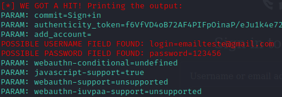

# Phishing para captura de senhas

### Objetivo
O objetivo desse desafio é entender o funcionamento de ferramentas de engenharia social, usando o Setoolkit para simular um ataque de phishing com o intuito de aprender sobre as vulnerabilidades e como se proteger de tais ataques.

### Ferramentas

- Kali Linux
- setoolkit

### Configurando o Phishing no Kali Linux

- Acesso root: ``` sudo su ```
- Iniciando o setoolkit: ``` setoolkit ```
- Tipo de ataque: ``` Social-Engineering Attacks ```
- Vetor de ataque: ``` Web Site Attack Vectors ```
- Método de ataque: ```Credential Harvester Attack Method ```
- Método de ataque: ``` Site Cloner ```
- Obtendo o endereço da máquina: ``` ifconfig ```
- URL para clone: http://www.site-de-teste.com

### Resutados



Esse projeto foi baseado no repositório do professor Cassiano e tem como objetivo educativo demonstrar o funcionamento de ataques de phishing.
